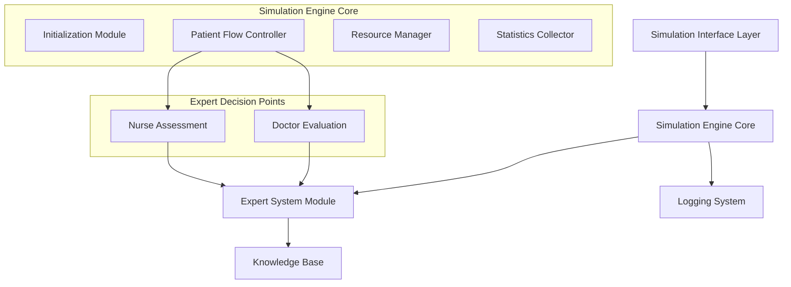
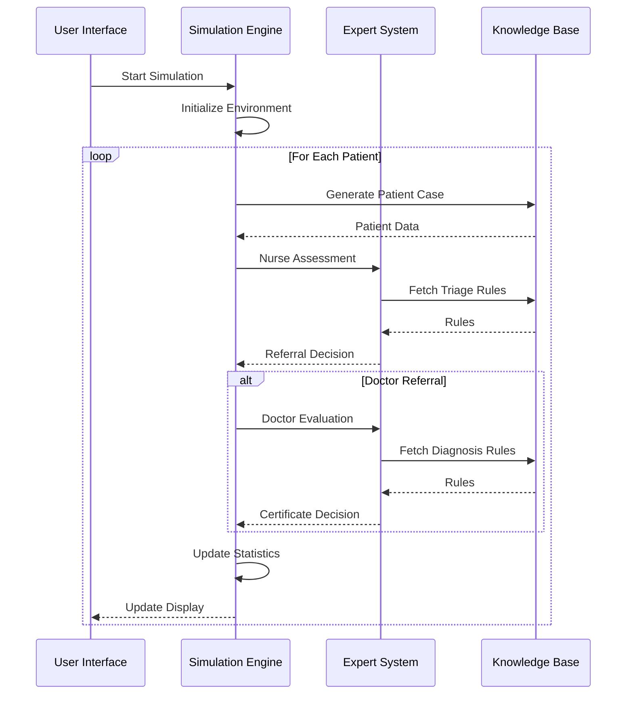

# Medical Certificate Issuance Support System - Simulation Architecture

## 1. High-Level Architecture



## 2. Simulation Components

### 2.1 Simulation Engine Core (`simulation.py`)
- **Initialization Module**
  - Clinic parameters setup
  - Staff resource allocation
  - Queue management system
  - Working hours configuration

- **Patient Flow Controller**
  - Patient case generation
  - Appointment scheduling
  - Queue management
  - Service time calculations

- **Resource Manager**
  - Staff availability tracking
  - Resource utilization monitoring
  - Bottleneck detection
  - Capacity management

- **Statistics Collector**
  - Wait time tracking
  - Resource utilization stats
  - Certificate issuance rates
  - Performance metrics

### 2.2 Expert System Module (`expert_system.py`)
- **Decision Point 1: Nurse Assessment**
  - Symptom severity evaluation
  - Triage rules application
  - Referral decision support

- **Decision Point 2: Doctor Evaluation**
  - Diagnosis validation
  - Certificate eligibility check
  - Leave duration determination

### 2.3 Knowledge Base (`predefined_cases.py`)
- Patient case templates
- Clinical protocols
- Decision rules
- Treatment guidelines

## 3. Simulation Workflow



## 4. File Structure

```
medical_certificate_system/
├── simulation.py           # Main simulation engine
├── expert_system.py        # Supporting expert system module
├── predefined_cases.py     # Knowledge base
├── main.py                 # GUI interface
├── requirements.txt        # Dependencies
└── simulation.log         # Simulation logs
```

## 5. Key Features

### 5.1 Simulation Core Features
- Discrete event simulation engine
- Multi-resource management
- Queue optimization
- Real-time statistics
- Performance analytics

### 5.2 Expert System Integration Points
- Automated triage decisions
- Certificate eligibility assessment
- Duration recommendations
- Protocol compliance checking

### 5.3 Analysis Capabilities
- Resource utilization analysis
- Bottleneck identification
- Waiting time analysis
- Certificate issuance patterns

## 6. Technology Stack

- **Simulation Engine**: SimPy (Discrete Event Simulation)
- **GUI Framework**: tkinter with ttkthemes
- **Expert System**: Custom rule engine module
- **Statistics**: NumPy/Pandas for analysis
- **Visualization**: Matplotlib for results

## 7. Simulation Parameters

### 7.1 Clinic Configuration
- Operating hours
- Number of staff
- Service time distributions
- Queue capacity

### 7.2 Patient Parameters
- Arrival rate distribution
- Case type distribution
- Priority levels
- Service time variations

### 7.3 Resource Parameters
- Staff schedules
- Skill levels
- Processing times
- Break patterns

## 8. Performance Metrics

- Average waiting time
- Resource utilization rates
- Certificate issuance rate
- Queue lengths
- Service completion times
- Staff workload distribution

## 9. Future Enhancements

1. Advanced scenario modeling
2. Real-time simulation adjustments
3. Predictive analytics integration
4. Resource optimization algorithms
5. Machine learning for pattern recognition 